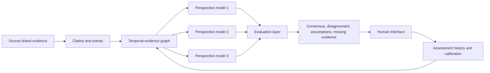

# Sovereign-Lens

Independent multi-agent intelligence for tracking how AI reshapes state and geopolitical power.

**Web:** [sovereignlens.ai](https://sovereignlens.ai)

**Motto:** The Horizon already exists. Sovereign Lens makes its programming observable.

--- 

> ⚠️ **AI-SLOP / HACKATHON README DRAFT**
>
> This README was produced rapidly with AI assistance during a hackathon. It intentionally mixes the working prototype with the intended architecture and has not yet received full human editing or methodological review. See **What actually works today** for the honest boundary between software and specification.

# Sovereign Lens

**Independent multi-agent intelligence for tracking how AI reshapes state and geopolitical power.**

Sovereign Lens is an open-source, evidence-first system for observing how artificial intelligence changes geopolitical influence, technological dependency, national capability, and state sovereignty.

## The contribution: the programmable Horizon

The Horizon is not an agent's long-term memory. It is shared, forward-facing state
outside any one agent: the accumulated option space produced by capital, talent,
compute, energy, infrastructure, data, culture, institutions, human networks,
standards, and AI systems.

States and other institutions already program this Horizon. Sovereign Lens observes
their public actions as writes to eight registers: **timers, commitments, parameters,
defaults, permissions, priors, capacities, and categories**. Each write records who
acted, what changed, when it activates, how binding and reversible it is, which
sovereign capabilities it affects, and the evidence supporting that observation.

Multiple models analyze the same write independently. Consensus becomes an
observation; divergence becomes parallax—a measurement of how different model
cultures parse the same change. The observer is therefore also observable.

See the [concept memo](docs/PROGRAMMABLE_HORIZON_AND_TRAJECTORY_SOVEREIGNTY.md),
the [`trajectory_hypothesis` schema](schemas/trajectory-hypothesis.schema.json),
and the [open-source promo production package](promo/README.md).

It is not intended to be another geopolitical news summarizer. Sovereign Lens converts source-linked evidence into a living graph of AI-related actors, assets, relationships, claims, and events. Multiple AI models then evaluate the same evidence independently, while a separate evaluation layer exposes where they agree, where they disagree, which assumptions drive their conclusions, and what evidence could change their views.

The objective is not to reproduce one country's narrative or one model provider's worldview. The objective is to create an independent, plural, and auditable evaluation layer for AI geopolitics.

---

## Current status

**Hackathon prototype / experimental research project**

The initial prototype was started during **Long Horizon Agents Build Day at AGI House on August 22, 2026**.

The immediate objective is to demonstrate one complete loop:

```text
Evidence
   ↓
Structured claims and events
   ↓
Temporal geopolitical AI graph
   ↓
Independent model assessments
   ↓
Agreement and disagreement analysis
   ↓
Human-readable provenance
```

### What actually works today

Three states, because two were hiding things:

* `[x]` verified end to end by a committed test or a reproducible run
* `[~]` partly real — the code path exists and is exercised, but the qualifier beside it is doing real work
* `[ ]` specification, not software

Ingestion and extraction

* [~] **Manual evidence ingestion** — 11 source-linked records (publisher, date, type, language, URL) are committed and inspectable. They are hand-authored; no path takes a document in.
* [ ] **Claim and event extraction** — nothing reads a document and emits structured claims.

Graph

* [~] **Actor and relationship graph construction** — 12 actors and assets and 15 typed, dated relationships are projected into a graph at any `as_of` by tested code. The records are hand-authored, not derived from evidence.
* [x] **Bitemporal snapshot with supersession preserved** — facts are filtered on `recorded_at <= as_of` before validity, so the view reproduces what was knowable then. Superseded facts stay visible rather than being deleted, and each snapshot carries a content digest.
* [x] **Interactive graph visualization** — `web/`: a 2D relationship graph with a time scrubber, current-versus-superseded fact treatment, and a one-click thirteen-month advance.

Assessment

* [ ] **Multiple perspective-model assessments** — the three perspectives are **deterministic fixture text**. No provider adapter exists and no model has been called.
* [~] **Consensus and disagreement evaluation** — divergence is preserved and shown rather than averaged, and material disagreement is distinguished from consensus. The axes are hand-authored; no evaluator compares model outputs.
* [x] **Evidence and provenance drill-down** — every visible claim resolves to its source, publisher, and the account that source speaks for (participant, regulator, oversight). A test asserts every reference in the fixture resolves.

Memory and calibration

* [~] **Persistent assessment memory** — assessments, predictions and methodology lessons persist to SQLite (`python3 demo.py --db sovereign.sqlite`). Nothing yet retrieves prior beliefs across runs.
* [x] **Falsifiable prediction ledger** — a prediction stores its probability, horizon, and the exact evidence-snapshot hash it was registered against.
* [x] **Retrospective calibration against later outcomes** — one prediction resolves and is scored (Brier 0.1225 against a 0.25 coin-flip baseline) and the accepted lesson moves methodology v1 → v2 with history preserved. Offline demo fixture, and n = 1.

Verify the ticks yourself:

```bash
python3 -m unittest discover -s tests    # projection, ledger, trajectories and eight registers
cd web && npm install && npm test        # 39 tests, including cross-language digest conformance
```

Provider credentials are not required for the offline demo. To prepare the live
multi-model panel, copy `.env.example` to `.env`, then follow
[`docs/API_ACCESS.md`](docs/API_ACCESS.md) and run
`python3 scripts/check_api_config.py`.

**Anything unchecked is specification, not software.** The most consequential
unchecked line is *multiple perspective-model assessments*: model plurality is
the project's central claim, and no model has yet been asked anything.

This project is not production-ready and should not be treated as an authoritative geopolitical intelligence source.

---

## Neutral example convention

All examples in this README are synthetic and use deliberately generic placeholders:

* **Country 1**
* **Country 2**
* **Country 3**
* **Institution 1**
* **Company 1**
* **Model 1**
* **Infrastructure Project 1**

They illustrate the data model and analytical workflow without making claims about real governments, companies, or geopolitical relationships. Production records must use real entity identifiers and verifiable evidence.

---

## Why this exists

AI is increasingly becoming a geopolitical instrument.

Access to foundation models, compute, cloud infrastructure, semiconductors, data, technical talent, deployment expertise, and evaluation capability can materially change the options available to a state. But access is not the same as ownership, control, or sovereignty.

A country may gain substantial AI capability while simultaneously becoming more dependent on another state or foreign provider for:

* compute
* model updates
* API availability
* cloud hosting
* cybersecurity
* technical support
* language localization
* evaluation tooling
* operational continuity

If an external actor withdraws access, changes prices, restricts use, or modifies the system, the recipient state may discover that it possessed **access** without possessing **control**.

Sovereign Lens treats AI capability itself as a changing structure of power.

It is designed to help investigate questions such as:

* Which states are gaining meaningful AI capability?
* Who owns or controls the infrastructure behind that capability?
* Which countries are becoming dependent on foreign providers?
* Which partnerships increase optionality, and which create lock-in?
* Can a state replace its current model, cloud, or compute provider?
* Does announced access translate into operational capability?
* Can local institutions independently evaluate imported AI systems?
* Where do different AI models interpret the same evidence differently?
* Which conclusions remain robust across models?
* What evidence would change the current assessment?

---

## Core thesis

> **In the AI era, sovereignty is not only the ability to build or purchase AI. It is the ability to independently evaluate, choose, operate, modify, audit, constrain, replace, and govern it.**

A state may possess significant AI capability without possessing full AI sovereignty.

Sovereign Lens distinguishes between several concepts that are often collapsed into one score:

| Concept         | Question                                                           |
| --------------- | ------------------------------------------------------------------ |
| **Capability**  | What can the state actually do?                                    |
| **Access**      | What technology can it currently use?                              |
| **Ownership**   | What does it legally and operationally control?                    |
| **Dependency**  | What capability disappears if an external actor withdraws support? |
| **Optionality** | How easily can the state switch providers or operating models?     |
| **Influence**   | What leverage does another actor gain through the relationship?    |

A country can gain capability while losing optionality. That tension is one of the project's central analytical questions.

---

## Analytical lineage and independence

Sovereign Lens is informed by the **Evaluation State** thesis: practical AI sovereignty depends not only on frontier-model ownership, but also on a state's capacity to independently evaluate, orchestrate, audit, replace, and govern AI systems.

This is a disclosed analytical perspective, not a claim of value-free neutrality.

The system is designed to make its own framework contestable. Claims remain linked to evidence, assumptions are exposed, model disagreements are preserved, and alternative interpretations can challenge both individual assessments and the project's underlying methodology.

Independence therefore comes from an open and auditable process—not from pretending that the project has no authorship or perspective.

---

## How it works



The intended pipeline has six stages:

1. **Ingest evidence** from primary and independently verifiable sources.
2. **Extract claims and events** without collapsing them into conclusions.
3. **Resolve actors, assets, and relationships** while preserving uncertainty.
4. **Update a temporal graph** of AI-related geopolitical change.
5. **Ask multiple models** to evaluate the same evidence package and graph state.
6. **Compare their assessments** and expose agreement, disagreement, assumptions, confidence, and provenance.

---

## Core data model

| Object                 | Purpose                                                                                  | Synthetic examples                                       |
| ---------------------- | ---------------------------------------------------------------------------------------- | -------------------------------------------------------- |
| **Actor**              | An entity that creates, controls, funds, receives, restricts, or evaluates AI capability | Country 1, Ministry 1, Company 1                         |
| **Asset / capability** | An AI-related resource or operational capacity                                           | Model 1, GPU Cluster 1, Training Program 1               |
| **Relationship**       | A persistent connection between actors or assets                                         | provides, depends_on, hosts, funds, restricts            |
| **Event**              | A time-bounded change in the graph                                                       | agreement signed, access granted, restriction imposed    |
| **Claim**              | A structured assertion extracted from evidence                                           | Country 2 provides Model 1 access to Country 1           |
| **Evidence**           | A source that supports, challenges, or contextualizes a claim                            | agreement, procurement record, technical document        |
| **Assessment**         | An interpretation produced by a model or human analyst                                   | capability increased; dependency may also have increased |

### Claims are not assessments

```text
Claim:
Country 2 granted Country 1 access to Model 1.

Assessment:
The agreement may increase Country 1's AI capability while also increasing
its dependency on infrastructure controlled by Country 2.
```

The first statement can potentially be verified from evidence. The second requires interpretation.

---

## Synthetic worked example

Suppose the following events occur:

```text
Country 2 grants Country 1 access to Model 1.
Company 1 begins constructing Infrastructure Project 1 in Country 1.
Country 2 launches a technical training program for Country 1's public sector.
Country 3 offers Country 1 access to an alternative cloud platform.
Country 1 adopts a national AI policy.
Institution 1 creates an independent model-evaluation laboratory in Country 1.
```

The graph might contain relationships such as:

```text
Country 2
   ├── provides ──> Model 1 ──> accessible_by ──> Country 1
   ├── finances ──> Infrastructure Project 1 ──> located_in ──> Country 1
   └── trains ──> Technical Workforce 1 ──> employed_in ──> Country 1

Country 3
   └── provides ──> Alternative Cloud Service ──> accessible_by ──> Country 1

Institution 1
   └── operates ──> Evaluation Laboratory 1 ──> located_in ──> Country 1
```

Sovereign Lens would not merely summarize these events. It would ask:

* How has Country 1's practical AI capability changed?
* Which dependencies increased?
* Did vendor optionality increase or decrease?
* Who owns and operates the relevant infrastructure?
* Can Country 1 continue operating if one provider withdraws?
* Which external actor gained influence?
* Did Country 1 gain independent evaluation capability?
* Do different models interpret the same change differently?

---

## Evidence and provenance

Documents are evidence, not the final analytical unit.

Each evidence record should preserve enough provenance for another contributor or analyst to inspect it:

```json
{
  "id": "evidence_001",
  "source_type": "government_document",
  "publisher": "Institution 1",
  "published_at": "2026-08-01",
  "retrieved_at": "2026-08-22T18:00:00Z",
  "language": "en",
  "url": "https://example.org/document",
  "content_hash": "sha256-placeholder",
  "supports": ["claim_001"],
  "challenges": [],
  "reliability_notes": "Primary source; implementation not yet independently verified."
}
```

Important provenance fields include:

* original source and publisher
* publication and retrieval dates
* source type and jurisdiction
* language and translation method
* content hash or archived copy
* extraction method and model version
* original excerpt
* supported and challenged claims
* corroborating and contradictory sources
* reliability notes

News may be useful for discovery and context, but it should not automatically become the system's primary epistemic layer. Whenever possible, Sovereign Lens should prefer primary, corroborated, or independently verifiable evidence.

---

## Perspective models

Sovereign Lens uses several independently developed models as analytical instruments.

Each perspective model should receive:

* the same analytical question
* the same evidence package
* the same graph snapshot
* the same requested time horizon
* the same structured output schema

This reduces avoidable context differences while preserving meaningful differences in reasoning.

### Models are not country delegates

A model developed in Country 2 should not automatically be interpreted as "Country 2's position," just as a model developed in Country 3 should not automatically represent that state's worldview.

Models may differ because of:

* training distributions
* architecture
* post-training
* safety policies
* system prompts
* language context
* access to information
* institutional incentives
* reasoning behavior

Those differences can be analytically useful, but they should not be overinterpreted.

### Example assessment schema

```json
{
  "agent": "model_1",
  "question": "How does Event 1 affect Country 1's AI sovereignty?",
  "assessment": "Country 1 gains capability but may become more dependent on externally controlled infrastructure.",
  "confidence": 0.68,
  "drivers": [
    "model access",
    "technical training",
    "external cloud dependency"
  ],
  "counterarguments": [
    "Country 1 retains access to an alternative provider",
    "the agreement may have limited operational scope"
  ],
  "assumptions": [
    "the announced program becomes operational",
    "Country 1 cannot host the model independently"
  ],
  "supporting_evidence": ["evidence_001"],
  "contradictory_evidence": [],
  "missing_evidence": [
    "contract termination rights",
    "local hosting rights",
    "availability of alternative providers"
  ]
}
```

---

## Evaluation layer

The evaluator compares model outputs rather than simply averaging them.

It should identify:

* **Consensus:** conclusions several models reach independently
* **Divergence:** conclusions on which models materially disagree
* **Assumptions:** explicit or hidden premises behind each conclusion
* **Evidence selection:** which sources each model relied upon or ignored
* **Confidence:** how certain each model claims to be
* **Missing evidence:** what information could resolve uncertainty
* **Prompt sensitivity:** whether small framing changes alter the outcome

Synthetic example:

```text
Question:
Did Event 1 increase Country 1's dependency on Country 2?

Model 1: Likely yes — confidence 71%
Model 2: Possibly — confidence 55%
Model 3: Insufficient evidence — confidence 43%
Model 4: Primarily capability-building — confidence 64%
```

The most useful output may not be the average. The useful output is often:

> **Why do they disagree?**

---

## Sovereignty dimensions

Sovereign Lens should not reduce sovereignty to one unexplained number.

A more defensible representation is a multidimensional profile:

| Dimension                      | Core question                                                                  |
| ------------------------------ | ------------------------------------------------------------------------------ |
| **Model sovereignty**          | Can the state access, inspect, modify, host, and replace its models?           |
| **Compute sovereignty**        | Who owns and controls the compute?                                             |
| **Infrastructure sovereignty** | Where are cloud services and data centers located, operated, and governed?     |
| **Data sovereignty**           | Who controls training, operational, and citizen data?                          |
| **Talent sovereignty**         | Does the state possess domestic technical and institutional capability?        |
| **Vendor optionality**         | Can the state realistically change providers?                                  |
| **Evaluation sovereignty**     | Can the state independently test whether systems work and remain acceptable?   |
| **Governance sovereignty**     | Can institutions audit, authorize, constrain, suspend, and replace AI systems? |

Illustrative qualitative profile:

```text
Country 1

Model sovereignty:          moderate
Compute sovereignty:        low
Infrastructure sovereignty: low–moderate
Data sovereignty:           moderate–high
Talent sovereignty:         moderate
Vendor optionality:         low
Evaluation sovereignty:     emerging
Governance sovereignty:     moderate–high
```

These bands are illustrative only. Sovereign Lens should not publish numerical sovereignty scores until the definitions, evidence rules, weighting choices, uncertainty treatment, and validation methodology are documented and reviewable.

---

## Potential data sources

Sovereign Lens should prioritize evidence diversity and provenance over raw document volume.

### Government and policy

* national AI strategies
* legislation and executive orders
* ministry announcements
* bilateral and digital-cooperation agreements
* procurement records and tenders
* export controls and sanctions
* budgets and parliamentary records
* development programs

### Models and software capability

* API and model availability
* open-weight releases
* model localization and language support
* licensing, hosting, and fine-tuning rights
* government model deployments
* usage restrictions and withdrawal conditions

### Compute and infrastructure

* GPU procurement
* national supercomputers
* data-center construction
* cloud-region expansion
* sovereign-cloud agreements
* semiconductor imports and exports
* power availability
* subsea cable and network infrastructure

### Corporate, talent, and research activity

* investments and joint ventures
* public-sector contracts
* research collaborations
* acquisitions and infrastructure deployments
* technical training programs
* university partnerships
* researcher migration
* workforce and laboratory formation

### Economic and multimodal evidence

* trade and foreign-direct-investment data
* infrastructure financing
* geospatial observations
* shipping and aviation data
* network measurements
* power-consumption signals
* data-center and semiconductor supply-chain indicators

Multimodal sources are future-facing unless explicitly implemented and documented in the repository.

---

## Hackathon MVP

The hackathon version should remain narrow and verifiable.

A credible same-day MVP is one complete evidence-to-evaluation loop with approximately:

* 5–15 source-linked evidence records
* 3–5 actors
* 3–10 AI assets or capabilities
* 10–30 structured relationships
* 3 perspective models
* 1 evaluator
* 1 graph view
* 1 disagreement panel
* source-level provenance

The demo should prove that the system can:

1. ingest a small evidence package
2. extract actors, assets, relationships, claims, and events
3. update a temporal graph
4. ask several models to assess the same change independently
5. identify consensus and disagreement
6. expose assumptions and missing evidence
7. trace every conclusion back to its sources

---

## Long-horizon memory and calibration

See [`docs/LONG_HORIZON_CONCEPT.md`](docs/LONG_HORIZON_CONCEPT.md) for the
conceptual framing: the horizon already exists, and the engineering task is to
make experience, succession, and learning auditable across agent generations.

Geopolitical analysis becomes more useful when the system can compare previous assessments with later outcomes.

```text
Previous assessment
        ↓
New evidence
        ↓
Observed outcome
        ↓
Calibration review
        ↓
Updated analytical method
```

Synthetic example:

```text
Initial assessment:
70% probability that an announced agreement produces operational deployment
within six months.

Six-month observation:
No operational deployment detected.

Potential learning:
The system may have overweighted official announcements and underweighted
implementation capacity.
```

A persistent memory layer may store:

* prior assessments
* model predictions
* reasoning summaries
* discovered evidence
* past disagreements
* calibration errors
* analyst corrections
* unresolved questions
* recurring assumptions

---

## Design principles

### Evidence before narrative

Narratives should be constructed from observable, traceable evidence.

### Claims before conclusions

The system should separate what happened from what it may mean.

### Events before documents

Documents are sources. Events and graph changes are the analytical objects.

### Graph before feed

Geopolitical relationships evolve over time and should not be reduced to a content stream.

### Multiple models before one oracle

No single model should define the system's worldview.

### Disagreement is information

Differences should be exposed and explained rather than averaged away automatically.

### Provenance everywhere

Users should always be able to ask: **Why does the system believe this?**

### Sovereignty means optionality

Access to advanced AI is not equivalent to sovereign control.

### Independence is architectural

Models, providers, prompts, and data sources should be replaceable.

---

## Prototype target stack

The target stack may include:

* **Backend:** Python, FastAPI, Pydantic
* **Frontend:** Next.js, React, TypeScript
* **Agent orchestration:** LangGraph or a lightweight asynchronous runner
* **Graph:** NetworkX for the prototype; Neo4j or PostgreSQL-based graph storage later
* **Storage:** JSON or SQLite for the prototype; PostgreSQL and pgvector later
* **Models:** provider adapters for OpenAI, Anthropic, Google, GLM, Qwen, DeepSeek, and open-weight models
* **Memory:** Stash or an append-only assessment history
* **Visualization:** React Flow, Cytoscape.js, D3.js, or a map layer

This list describes the intended prototype architecture. The actual repository dependencies and committed code are the source of truth.

---

## Local development

### Micro partner integrations

The optional `integrations/` slice demonstrates the event-partner architecture without
putting a hosted service in the analytical critical path:

```bash
python3 -m integrations.micro --out /tmp/sovereign-lens-integrations
```

It emits a Temporal-ready reassessment task, a Stash-ready research-memory record, and a
Coframe presentation-safety contract. The optional Temporal workflow is in
`integrations/temporal_workflow.py`; the web interface emits the corresponding safe UI
events. See the live [build integration notes](https://sovereignlens.ai/build).

Official references: [Temporal documentation](https://docs.temporal.io/),
[Stash documentation](https://www.joinstash.ai/docs), and
[Coframe documentation](https://docs.coframe.com/).

### Three-minute offline demo

The initial demo exercises the long-horizon memory loop with Python and SQLite,
without API keys or network access:

```bash
python3 demo.py --paced
```

It demonstrates a dated graph snapshot, three transparent perspective fixtures, a
falsifiable prediction, later evidence, bitemporal supersession, calibration, and
a human-reviewed methodology update. The perspective text is deterministic demo
data, not output from live model providers.

Run the tests with:

```bash
python3 -m unittest discover -s tests -v
```

See [`docs/PITCH.md`](docs/PITCH.md) for the three-minute presentation and
[`docs/DEVELOPMENT_PLAN.md`](docs/DEVELOPMENT_PLAN.md) for the database and build
plan.

### Presentation interface

The `web/` dossier renders the same loop as one screen, built for a projector at
1440x900:

```bash
cd web
npm install
npm run dev      # http://localhost:5173
npm test         # 39 unit and component tests
```

It reads a frozen local fixture through a `DataSource` seam, so it can be
repointed at a `demo.py --json` export or an HTTP endpoint without changing a
component. See [`web/README.md`](web/README.md) for the design rules, the data
seam, and what the screen explicitly does not claim.

### Planned full application

```bash
git clone https://github.com/Dim25/Sovereign-Lens.git
cd Sovereign-Lens
```

The two run paths above are verified against the committed repository. The
ingestion, extraction and provider-adapter layers are not built, so there is no
launch command for them yet.

Do not commit API keys, private evidence, restricted data, or credentials.

---

## Seed evidence

The prototype is intended to use a small set of real, source-linked records rather than documentation-only fixtures.

One case is committed and inspectable: `case_uae_us_ai_infrastructure`, in
[`web/src/data/uae-us-ai-infrastructure.fixture.json`](web/src/data/uae-us-ai-infrastructure.fixture.json).

| | Count |
|---|---|
| Sources | 11 |
| Actors and assets | 12 |
| Typed relationships | 15 |
| Facts | 11 |
| Perspective assessments | 6 (two snapshots x three perspectives) |
| Disagreement axes | 5 |
| Predictions | 1 registered, 1 resolved |
| Methodology lessons | 1 accepted |

Every source is a real, public, first-party or oversight document with a live
URL: UAE Embassy statements, Microsoft and G42 announcements, the Congressional
Record, a Commerce export statement, and a Congressional Research Service
overview. Two facts are lifted verbatim from `demo.py` so the screen and the
terminal cannot disagree.

The assessment text over that evidence is deterministic fixture data, not model
output. The 2026 capacity figure is *reported* by a participant government and
is not independently verified.

Synthetic Country 1 / Country 2 examples are used only for explaining the methodology.

---

## Limitations and responsible use

Known or expected limitations include:

* incomplete or delayed public evidence
* strategic misinformation
* translation errors
* extraction mistakes and hallucinations
* duplicated or circular sourcing
* hidden contractual terms
* ambiguous entity resolution
* shared biases across models
* model-version drift
* prompt sensitivity
* false confidence and false precision
* difficulty distinguishing announced access from operational capability

Sovereign Lens should not be used as the sole basis for:

* military action
* sanctions
* diplomatic retaliation
* intelligence attribution
* public accusations
* critical-infrastructure intervention
* automated policy decisions

High-impact conclusions require independent human review and additional verification.

Sovereign Lens is not a geopolitical prediction oracle, propaganda engine, military targeting system, automated foreign-policy decision-maker, or substitute for expert analysis.

---

## Contributing

Contributions are welcome, especially across countries, disciplines, languages, and model ecosystems.

Useful contribution areas include:

* agent orchestration
* knowledge graphs
* geopolitical datasets
* source verification
* structured extraction
* model evaluation
* multimodal ingestion
* international relations
* sovereign AI research
* provenance and uncertainty
* long-horizon memory
* calibration
* visualization
* multilingual analysis

A typical contribution flow:

1. Open an issue describing the proposed change.
2. Create a focused branch.
3. Add or update tests where possible.
4. Document methodological assumptions.
5. Submit a pull request.
6. Explain how the change affects provenance, reproducibility, or independence.

Evidence contributions should include enough provenance for another contributor to verify the source.

Upstream contributions are strongly encouraged, but they are not required by the Apache 2.0 license.

---

## Open-source philosophy

Sovereign Lens is intended as open infrastructure.

The project should remain:

* inspectable
* reproducible
* evidence-first
* model-plural
* internationally usable
* vendor-independent
* open to methodological criticism

No single model provider, state actor, institution, or source should automatically become the project's source of truth.

---

## License

Licensed under the **Apache License 2.0**.

See `LICENSE` for details.

Apache 2.0 permits commercial and non-commercial use, modification, and distribution while preserving notices and providing an explicit patent grant.

---

## Maintainer

**Dima Filatov**

Building Sovereign Lens at the intersection of sovereign AI, multi-agent evaluation, geopolitical intelligence, and deployed AI systems.

LinkedIn: [linkedin.com/in/dim25](https://linkedin.com/in/dim25)

---

## Hackathon origin

Initial prototype created during:

**Long Horizon Agents Build Day**
**AGI House**
**August 22, 2026**

---

> **We are not building another geopolitical news summarizer. We are building a living graph of how AI capability moves power between states—and using independent AI models to evaluate what those changes mean.**
